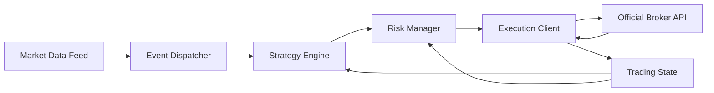

# Architecture

## High-level flow

## System boundaries

- The broker-specific integration stays behind the execution adapter.
- Strategy code never talks to the broker directly.
- Risk always has the final gate before an order leaves the system.
- Trading state is the source of truth for the local view of positions and orders.

## Data flow

1. Market data enters through `MarketDataFeed`.
2. The dispatcher normalizes and publishes events.
3. `TradingState` updates the canonical snapshot.
4. `StrategyEngine` evaluates the snapshot and emits a signal.
5. `RiskManager` approves, reshapes, or rejects the signal.
6. `ExecutionClient` sends the order through the official API.
7. Execution reports flow back into `TradingState` for reconciliation.

## Failure handling

- Stale or missing market data must block new entries.
- Execution rejections must be recorded and surfaced as state transitions.
- Temporary disconnects must trigger reconnect logic without losing open-order awareness.
- Duplicate external events must be deduplicated before they reach the strategy.
- Divergence between local state and broker state must trigger reconciliation before further trading.

## Conceptual module contracts

- `MarketDataFeed` owns connectivity and normalization.
- `StrategyEngine` owns signal generation.
- `RiskManager` owns approval and enforcement.
- `ExecutionClient` owns order transport and broker translation.
- `TradingState` owns the canonical ledger and reconciliation.

## Adapter rule

The concrete broker implementation is an adapter, not a core dependency. That keeps the system portable across brokers that expose different official APIs while preserving a stable internal model.
